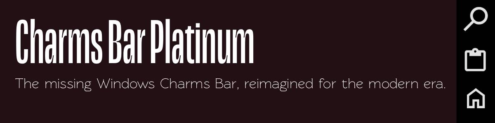
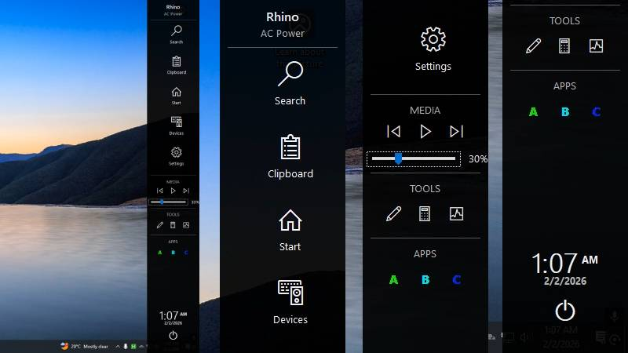
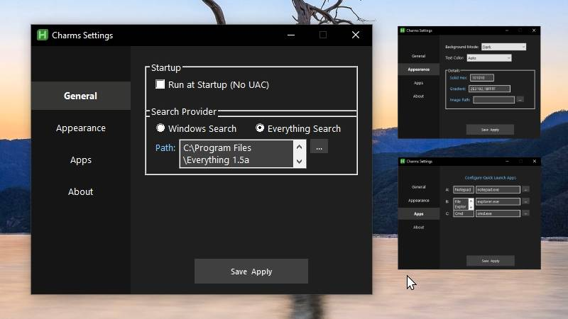

# Charms Bar Platinum

> **The missing Windows Charms Bar, reimagined for the modern era.**  
> A sleek, touch-friendly, and fully customizable sidebar for Windows 10 and 11.

---

## 🖼️ Gallery

  
*Clean, modern interface designed for both Mouse and Touch.*

  
*Deep customization with a fully Dark Mode Settings Panel.*

---

## ✨ Features

- **🚀 Instant Access**: Hover over the top-right corner or press `Win+C`.
- **🎨 Deep Customization**:
  - **Dark/Light Modes**: Matches your system aesthetic.
  - **Custom Backgrounds**: Use solid colors, gradients, or your own images.
  - **Aspect Fill**: Wallpaper support that fits perfectly without stretching.
- **⚡ Quick Actions**:
  - **Search**: Integrated with **Everything** or Windows Search.
  - **System**: Quick access to Settings, Start, Clipboard, and Devices.
  - **Tools**: Built-in shortcuts for Snip, Calculator, and Task Manager.
- **📱 Touch Optimized**: Large, touch-friendly targets perfect for tablets.
- **🔋 Power User Ready**:
  - **Silent Startup**: Runs automatically without UAC prompts.
  - **Multi-Monitor**: Appears on whichever screen you are using.
  - **Portable**: Single script file using `CharmsSettings.ini`.

---

## 📥 Installation

### **Option 1: Easy (Recommended)**
**[Download the latest .exe](https://github.com/OmniTx/CharmsBar/releases)**  
Just download the compiled executable and run it. No AutoHotkey installation is required.

### **Option 2: Advanced (Source Script)**
1. **Download AutoHotkey v2**: [Get it here](https://www.autohotkey.com/).
2. **Download the Script**: Save `charmsbar-phi.ahk` to your desired folder.
3. **Run**: Double-click the file.
4. **Setup**: The script will ask for Admin rights once to set up the high-priority task scheduler (for silent startup).

---

## ⚙️ Configuration

Press `Win+C` to open the bar, then click the **Gear Icon** at the bottom.

### **General**
- **Startup**: Toggle "No UAC" startup.
- **Search Provider**: Choose between native Windows Search or the ultra-fast **Everything**.

### **Appearance**
- **Mode**: Choose between *Dark, Light, Custom, Gradient, or Image*.
- **Styling**: Tweak hex colors, gradients, and text visibility.

### **Apps**
- **Quick Launch**: Configure shortcuts for slots **A**, **B**, and **C** to your favorite apps.

---

## ⌨️ Shortcuts

| Key Combo | Action |
| :--- | :--- |
| `Win + C` | Toggle Charms Bar |
| `Win + Alt + C` | Center Active Window |
| `Top-Right Corner` | Mouse Hover to Open |

---

## 👨‍💻 Credits

**Created by:** Imran Ahmed  
**Co-Developed with:** Antigravity (Google DeepMind)  
**License:** MIT
